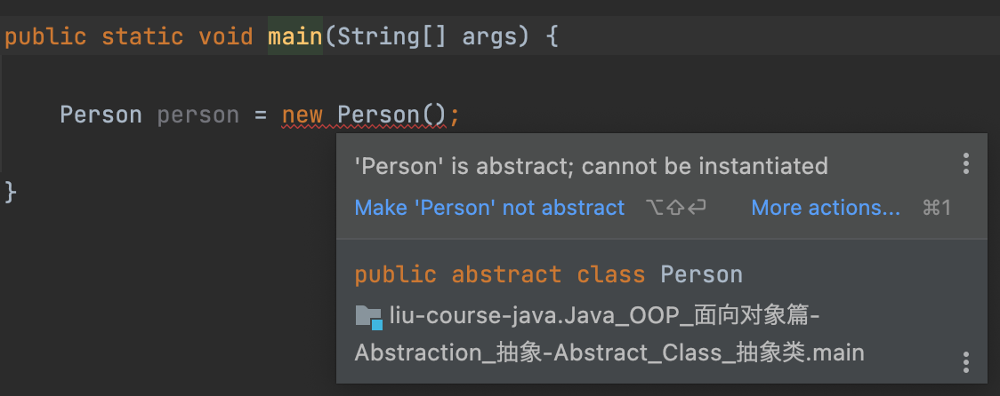

# 我在纸上画个小人也是"人"吗？

---

 

## Abstract 抽象

抽象类的现实意义是，**对于一个类，我无法描述它全部的行为，只能描绘大概的"轮廓"**，至于能描述到什么程度都无所谓，只要这个类声明为`abstract`，就说明这个类无法被完全地诠释。

一个类既然是抽象的，那就不是具象的，所以不能被实例化。如果试图`new`一个`abstract class`的对象，在编译级别就会报错。

任意一个类都可以被抽象，抽象与否只取决于开发者在设计程序时的考虑，Java对于抽象的程度与形式是很自由的。在设计一个抽象类时，往往需要注意

- 是否要抽象这个类的行为（即使不处理也是可行的）
- 如果该类有抽象的行为，则由子类去实现

下一节就抽象行为（方法）作进一步讲解。

 

---

 

***- 小CASE -***

**1. `Person`类创建对象时遇到异常，为什么？如何解决？**

 

---

_关注全网ID：**@老刘大数据** 版权所有_