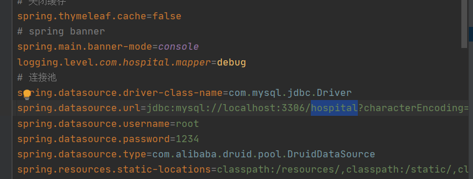

# 医院管理系统

#### 🛫 介绍
管理员
包括权限管理、住院管理、门诊管理、系统管理、数据中心、仓库管理、排班管理、药房管理、用户管理、缴费管理等
患者
包括住院管理、门诊管理、缴费管理等

是一款拿来即用的毕设项目

毕设脚手架工程，拿来即用，简单便捷，适合小白用来开发简单的项目，可接计算机毕设项目

#### 👑 核心功能

商家端 菜单管理、公告管理、配送管理、秒杀中心、用户管理

客户端 秒杀管理，菜单管理、配送管理、购物车、个人中心、订单管理

#### 🚂 软件架构 

Java后台：SpringBoot 2.1.0 + Mybatis+ 权限管理 + Apache poi

前台页面：Vue2.0 + ElementUI + Jquery + tinymce（富文本插件）

数据库：Mysql

注意：JDK选择1.8版本，Mysql选择5+版本&&8+

前后端分离，页面可单独部署，默认放在项目的static文件夹，随后端工程一起访问。

#### 🚁 安装教程 

使用git下载本项目

https://gitee.com/mxjindex/hospital-management-system.git

或者直接下载zip解压

1. 使用idea打开项目文件夹导入工程

2. 配置maven，下载项目依赖

3. 新建数据库　hospital，执行hospital.sqｌ文件

4. 修改application.yml中的数据库密码

5. 项目依赖下载完成后，直接运行 Application 启动SpringBoot即可

6. 运行效果   
   

#### 🛸 使用说明

1. 登录页面请访问：

http://localhost:8080

2.管理员 

账号：admin，密码：123456
患者
账号：mz，密码：123456

数据库密码进行了加密

1.在MySQL中新建数据库hospital,字符集编码utf-8mb4
2.运行hospital-admin-system.sql脚本,导入数据表
3.用idea导入项目,所有文件utf-8编码
4.修改配置文件application.properties,数据库环境设置为自己的MySQL
5.等待idea将所有jar包导入完成,可用阿里云镜像加快依赖导入速度
6.启动后访问地址 localhost:8080
超级管理员用户：admin密码：123456
门诊部账号mz  门诊部密码123456
jdk安装1.8的

添加的新用户密码默认：123456

druid阿里数据监控平台账号admin  密码123456

#### 🎨 界面截图

登录

项目主页

门诊管理

住院管理

系统管理、角色管理、数据管理、用户管理

统计管理

数据中心

排班、药房、仓库管理

我的微信：

####  请作者喝杯咖啡

