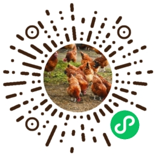

#  小象电商 智慧农庄电商小程序

### 体验环境
1.微信小程序

- 

2.后台地址

http://mall.weixinai.cn/
账户：admin
密码：123456

#### 介绍
小象智慧农庄是采用JAVA开发的B2C商城系统，产品核心代码经过多个项目成功上线实施打磨而成，源代码成熟度极高且稳定，代码前后端分离， 包含商城、商户管理、优惠券、积分、预售、会员、充值、多门店等功能，非常适合企业或个人二次开发；

 **如果对您有帮助，您可以点右上角 “Star” 收藏一下 ，获取第一时间更新，谢谢！** 

#### 小象智慧微信： yubang1010 
- 

#### 官网

1. 官网地址：https://www.xiaoxiangai.com

#### 软件架构

1、SpringBoot2+Jpa+MybatisPlus+SpringSecurity+jwt+redis+Vue

 
#### 商城功能

1. 商品管理：商品分类、管理商品、浏览记录、图片素材、美食厨房分类、美食厨房、预售商品分类；
2. 会员管理：会员、会员等级、用户账单、在线会员；
3. 微信管理：微信支付管理、微信模版消息、小程序配置；
4. 订单管理：订单、评论管理，物流快递；
5. 商城配置：首页幻灯片、首页导航按钮、首页滚动新闻、热门搜索、个人中心菜单、包邮配送、购物提示、小程序路由、群二维码配置、首页主题商品、广告配置；
6. 营销管理：优惠券制作、已发布优惠券、优惠卷领取记录；
7. 门店管理：门店配置、门店列表、核销订单、店长管理；
8. 系统管理&&系统工具；

#### 用户权益

1. 允许免费用于学习、毕设等。
2. 代码文件需保留相关license信息。
3. 禁止直接将本项目挂淘宝等商业平台出售。
4. 禁止基于本项目直接进行商业项目和获利的相关行为。
5. 非界面代码50%以上相似度的二次开源，二次开源需先联系作者。
