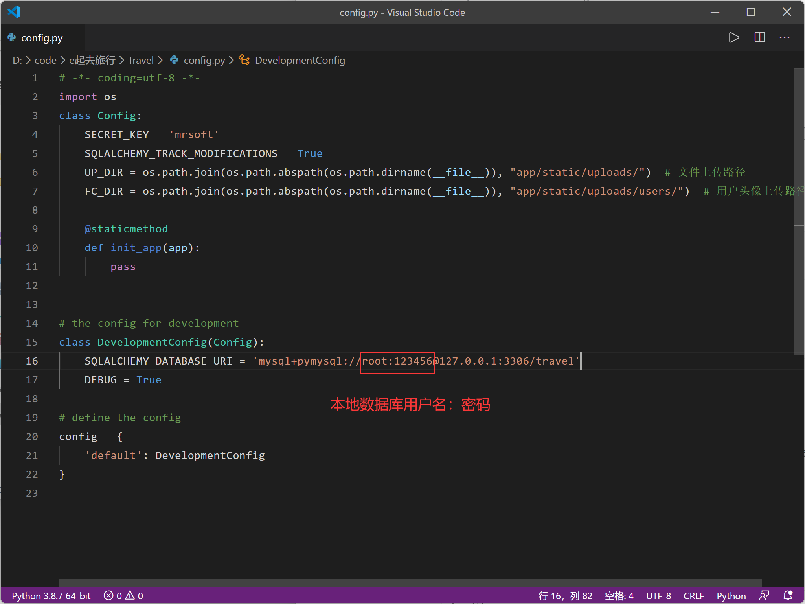
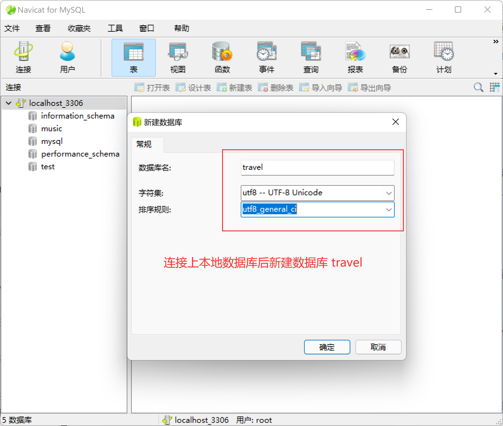
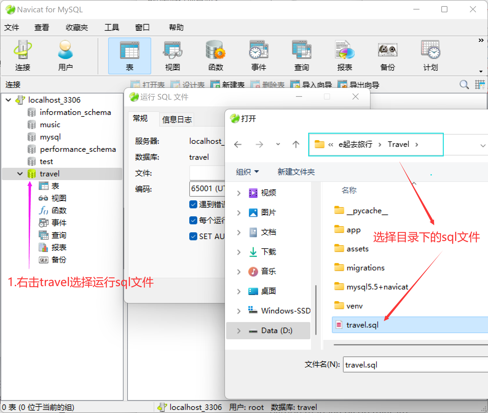
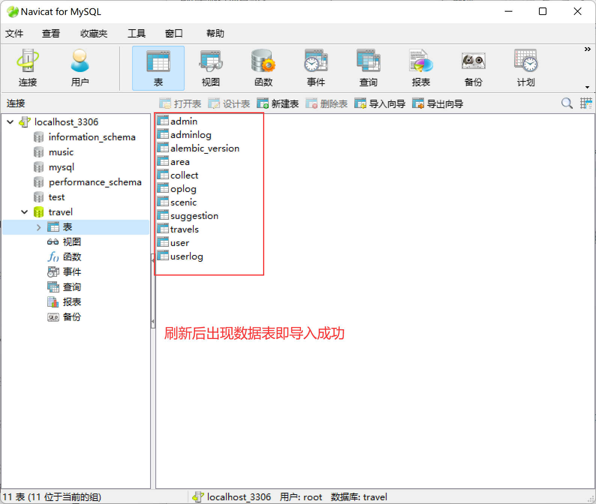
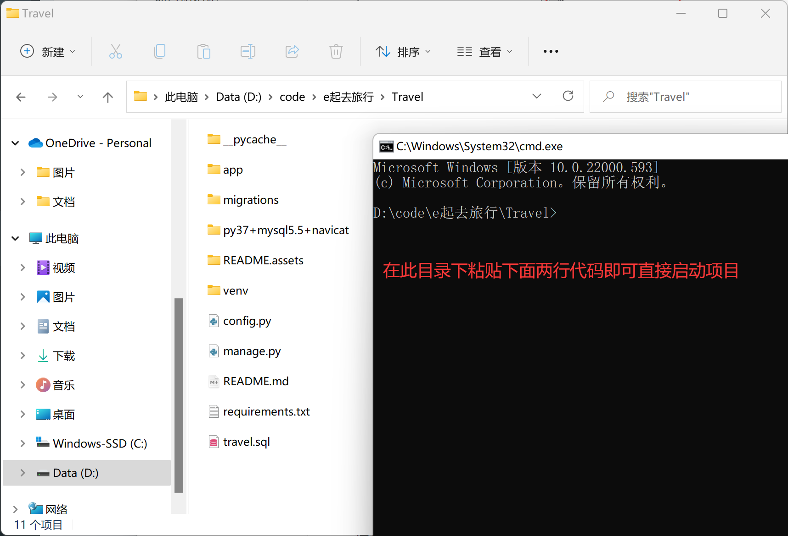
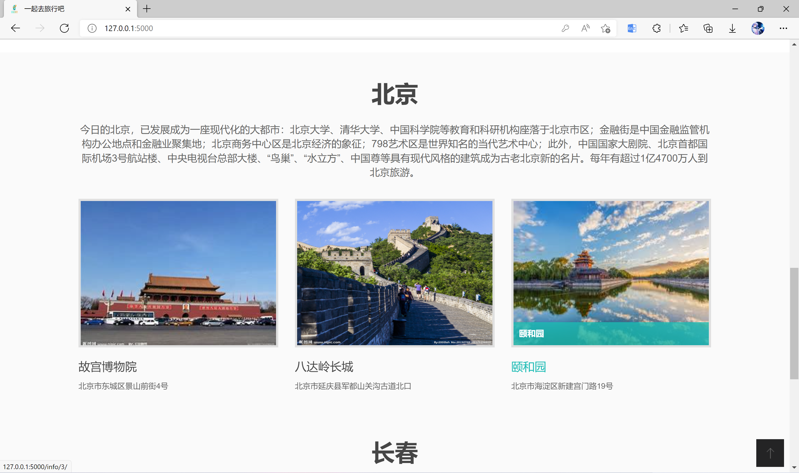
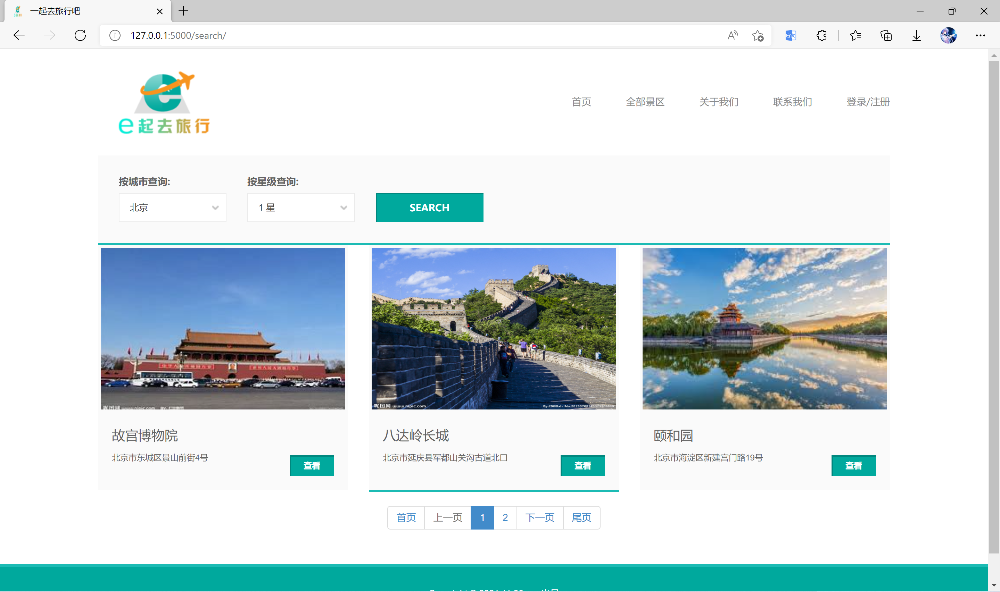
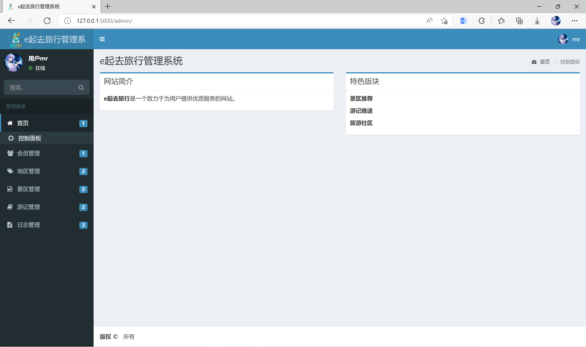
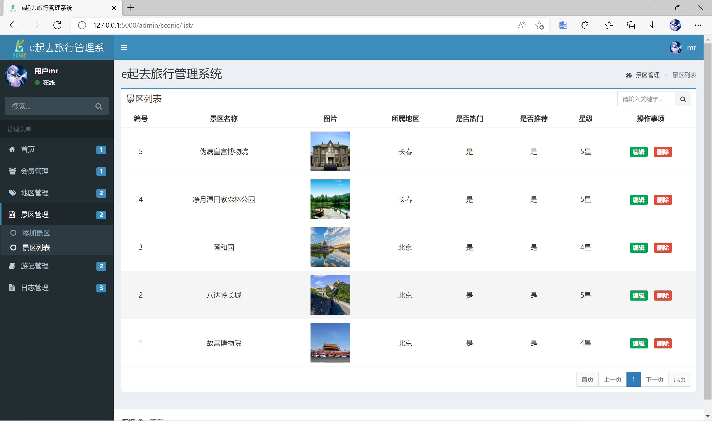

# e起去旅行项目部署

修改参考自明日科技的项目。[明日科技 - 主页 (163.com)](https://study.163.com/provider/2789686/index.htm)

运行环境：win11+py3.7.6+flask框架+mysql5.5+navicat

**使用3.7.6以上或其它版本可能会报错**

***建议删掉电脑上的python,安装我项目上的python3.7.6***

# 开始

**$mysql5.5+navicat**

mysql安装参考:[MySQL5.5怎么安装-mysql教程-PHP中文网](https://www.php.cn/mysql-tutorials-421476.html)

**$mysql5.5 安装时必须自定义编码集中的utf-8编码，否则数据库会出现乱码。**

$若mysql为 用户名：root   密码: 123456   则无需修改 config.py，否则请自行修改配置文件。下图







# cmd启动命令



```
venv\Scripts\activate
python manage.py runserver --threaded
```

首页：127.0.0.1:5000

后台：http://127.0.0.1:5000/admin

初始密码：mrsoft

# 项目初始化

```
$生成虚拟环境
python -m venv venv

$启动虚拟环境
venv\Scripts\activate

$安装依赖
pip install -i https://pypi.douban.com/simple/ --trusted-host pypi.douban.com -r requirements.txt

$初始化数据库
python manage.py db init 
$数据库迁移 报错alembic.util.exc.CommandError: Can't locate revision identified by '423caff1b936'参考：https://blog.csdn.net/m0_37605642/article/details/90638195
$由于版本号不同的问题，需删除travel中的alembic_version表
python manage.py db migrate
python manage.py db upgrade

$--treaded  非阻塞启动   0.0.0.0    监听全网，若部署到服务器上
python manage.py runserver --threaded --host 0.0.0.0
```

# 项目图片一览










